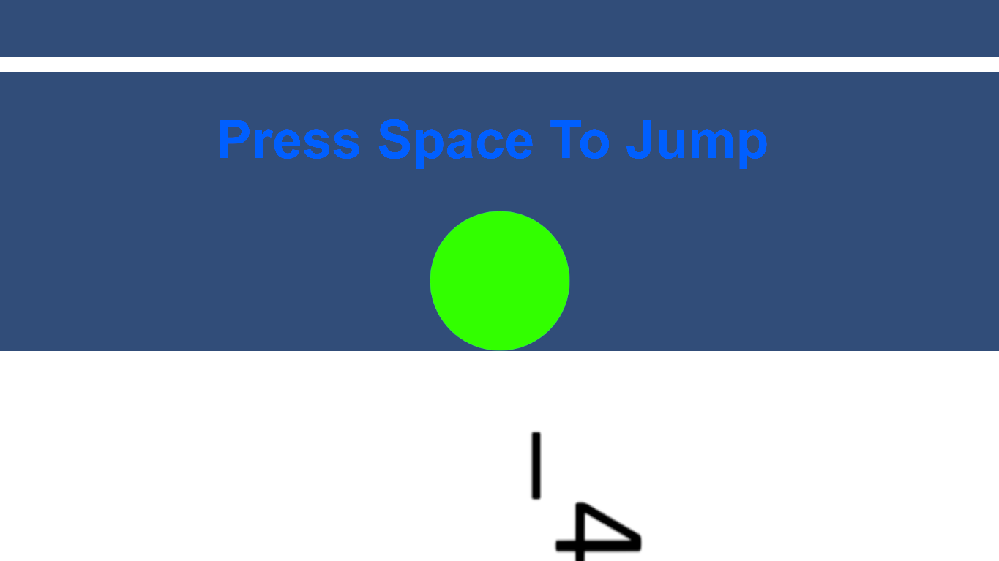
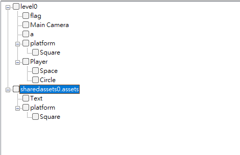
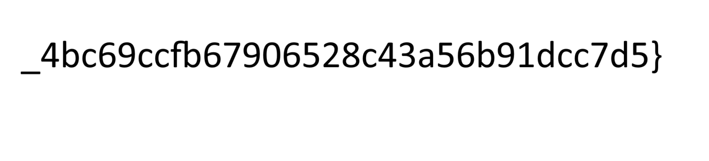
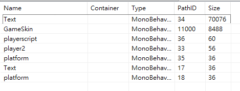
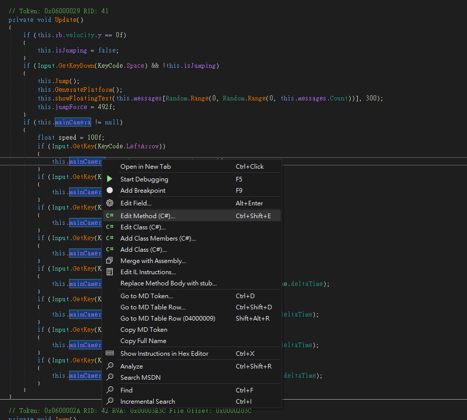

# Jump Jump - Writeup

## Files related to solving the challenge are in extra_process folder

The Beginning -> Jump_Jump\
Crack it open -> N/A\
Deobfuscation -> extra_process\
b64 GameObject where are you -> extra_process


## Please open issue should you have any questions. It will be added to the respective Q&A section.

Author: S051_Destroy Lai Lai's Machine (aka DLLM)

## Situation

Jump Jump

I created a simple game for you. Hope you don‘t break your spacebar. Have fun!!!

Author: Paco\
Flag Format: PUCTF25{[a-zA-Z0-9_]+_[a-fA-F0-9]{32}}

Hint: N/A

Attachments:\
Jump_Jump.zip\
(Stored at ./Jump_Jump.zip)

## The Beginning

After downloading and unzipping `Jump_Jump.zip`, we can see a file structure of

```tree
Jump_Jump
│   Jump Jump.exe
│   UnityCrashHandler64.exe
│   UnityPlayer.dll
│
├───Jump Jump_Data
│   │   app.info
│   │   boot.config
│   │   globalgamemanagers
│   │   globalgamemanagers.assets
│   │   globalgamemanagers.assets.resS
│   │   level0
│   │   RuntimeInitializeOnLoads.json
│   │   ScriptingAssemblies.json
│   │   sharedassets0.assets
│   │   sharedassets0.assets.resS
│   │
│   ├───Managed
│   │       Assembly-CSharp.dll
│   │       Mono.Security.dll
│   │       ...
│   │
│   ├───Plugins
│   │   └───x86_64
│   │           lib_burst_generated.dll
│   │
│   └───Resources
│           unity default resources
│           unity_builtin_extra
│
└───MonoBleedingEdge
    ├───EmbedRuntime
    │       ...
    │
    └───etc
        └───mono
            ├───...
```

### Informations

We know that

- This is a unity game
- It uses mono runtime
- By the description of the challenge, we need to jump alot

### Let's Play

Let's try to play the game first, and see what happens



Well, we do need to spam space to jump


Hmm, now we know we have 2 parts of the flag

## The Beginning - checkpoint Q&A

Q - Why does this Q&A look unnecessary?\
A - Because I can't think of any Q&A here

## Crack it open

I gave up after jumping for like 10 times, let's just crack the game open and save our time

Good news is that this game uses mono and not il2cpp, so we have direct access to the dll\
so we can just use dnSpy to load `Assembly-CSharp.dll` (the entry point of the game) and see what's inside

After loading it, we can see multiple scripts in the game

```cs
// 
// 
// Types:
// 
// <Module>
// <PrivateImplementationDetails>
// platform
// player2
// playerscript
// Text
// UnitySourceGeneratedAssemblyMonoScriptTypes_v1
```

`<Module>` is usually not useful, we can ignore it\
`<PrivateImplementationDetails>` looks weird, but inside looks gribbish, let's ignore it for now

`platform`'s code seems very simple, just destroy something every 30 unknown unit time, we can ignore it

```cs
using System;
using UnityEngine;

// Token: 0x02000003 RID: 3
public class platform : MonoBehaviour
{
    // Token: 0x06000026 RID: 38 RVA: 0x00002499 File Offset: 0x00000699
    private void Start() {
         Object.Destroy(base.gameObject, this.destroyTime);
    }

    // Token: 0x04000005 RID: 5
    public float destroyTime = 30f;
}
```

`player2` contains obfuscated c# code, we will get back to it later\
`playerscript` seems important, as it includes all the texts that shows at every level

```cs
using UnityEngine;

// Token: 0x02000004 RID: 4
public class playerscript : MonoBehaviour
{
    // Token: 0x06000028 RID: 40 RVA: 0x000024C0 File Offset: 0x000006C0
    private void Start()
    {
        this.rb = base.GetComponent<Rigidbody2D>();
        this.mainCamera = Camera.main;
        if (this.mainCamera == null)
        {
            Debug.LogError("Main camera not found!");
        }
        this.lastPlatformPosition = base.transform.position + new Vector3(0f, -50f, 0f);
        this.messages = new List<string>
        {
            "You're doing great!", "You know there is a flag at the end, right?", "You're almost there!", "You know there is 2 parts to the \nflag, right?",
            ...
            "The flag can be yours in a \ngoogolplexianth of a googolplexianth of a minute!", "HI!", "Hello!", "Greetings!", "Salutations!", "Howdy!", "Hey!", "Yo!", "Hi there!", "Hello there!", "Don't keep your flag!", "flag: PUCTF25{This_game_is_so_fun_....."
        };
        ...
    }

    ...
}
```

That's fast and easy to get the first part of the flag\
`PUCTF25{This_game_is_so_fun_.....`

`Text` is very similar to `platform`, also to destroy a game object, but this one is 5 unknown unit time, we can ignore this too\
In`<UnitySourceGeneratedAssemblyMonoScriptTypes_v1>`

```cs
using System;
using System.CodeDom.Compiler;
using System.ComponentModel;
using System.Runtime.CompilerServices;

// Token: 0x02000006 RID: 6
[CompilerGenerated]
[EditorBrowsable(EditorBrowsableState.Never)]
[GeneratedCode("Unity.MonoScriptGenerator.MonoScriptInfoGenerator", null)]
internal class UnitySourceGeneratedAssemblyMonoScriptTypes_v1
{
    // Token: 0x06000030 RID: 48 RVA: 0x00003F5C File Offset: 0x0000215C
    [MethodImpl(MethodImplOptions.AggressiveInlining)]
    private static UnitySourceGeneratedAssemblyMonoScriptTypes_v1.MonoScriptData Get()
    {
        UnitySourceGeneratedAssemblyMonoScriptTypes_v1.MonoScriptData monoScriptData = default(UnitySourceGeneratedAssemblyMonoScriptTypes_v1.MonoScriptData);
        monoScriptData.FilePathsData = new byte[]
        {
            0, 0, 0, 1, 0, 0, 0, 28, 92, 65,
            115, 115, 101, 116, 115, 92, 83, 99, 114, 105,
            112, 116, 92, 102, 108, 97, 103, 105, 110, 104,
            101, 114, 101, 46, 99, 115, 0, 0, 0, 1,
            0, 0, 0, 26, 92, 65, 115, 115, 101, 116,
            115, 92, 83, 99, 114, 105, 112, 116, 92, 112,
            108, 97, 116, 102, 111, 114, 109, 46, 99, 115,
            0, 0, 0, 1, 0, 0, 0, 30, 92, 65,
            115, 115, 101, 116, 115, 92, 83, 99, 114, 105,
            112, 116, 92, 112, 108, 97, 121, 101, 114, 115,
            99, 114, 105, 112, 116, 46, 99, 115, 0, 0,
            0, 1, 0, 0, 0, 22, 92, 65, 115, 115,
            101, 116, 115, 92, 83, 99, 114, 105, 112, 116,
            92, 84, 101, 120, 116, 46, 99, 115
        };
        monoScriptData.TypesData = new byte[]
        {
            0, 0, 0, 0, 8, 124, 112, 108, 97, 121,
            101, 114, 50, 0, 0, 0, 0, 9, 124, 112,
            108, 97, 116, 102, 111, 114, 109, 0, 0, 0,
            0, 13, 124, 112, 108, 97, 121, 101, 114, 115,
            99, 114, 105, 112, 116, 0, 0, 0, 0, 5,
            124, 84, 101, 120, 116
        };
        monoScriptData.TotalFiles = 4;
        monoScriptData.TotalTypes = 4;
        monoScriptData.IsEditorOnly = false;
        return monoScriptData;
    }

    // Token: 0x02000008 RID: 8
    private struct MonoScriptData
    {
        // Token: 0x04000011 RID: 17
        public byte[] FilePathsData;

        // Token: 0x04000012 RID: 18
        public byte[] TypesData;

        // Token: 0x04000013 RID: 19
        public int TotalTypes;

        // Token: 0x04000014 RID: 20
        public int TotalFiles;

        // Token: 0x04000015 RID: 21
        public bool IsEditorOnly;
    }
}
```

look what do we have here, hexadecimal values of possibly ascii!

After some decryption, we get the following:

```none
FilePathsData: ��������\Assets\Script\flaginhere.cs��������\Assets\Script\platform.cs��������\Assets\Script\playerscript.cs��������\Assets\Script\Text.cs

TypesData: �����|player2����    |platform����
|playerscript�����|Text
```

It seems that we have a script called `flaginhere.cs`, but we don't have a `flaginhere` in Assembly-CSharp.dll. Where could it be?

By comparing the files in FilePathsData and Assembly-CSharp.dll, we can see that the file `flaginhere.cs` corresponds to `player2`, time for deobfuscation!

## Crack it open - checkpoint Q&A

Q - so what's inside `<PrivateImplementationDetails>`?\
A - you can go take a look yourself, but I'm placing it here anyways

```cs
using System;
using System.Runtime.CompilerServices;
using System.Runtime.InteropServices;

// Token: 0x02000007 RID: 7
[CompilerGenerated]
internal sealed class <PrivateImplementationDetails>
{
    // Token: 0x0400000F RID: 15 RVA: 0x00008F70 File Offset: 0x00007170
    // Note: this field is marked with 'hasfieldrva'.
    internal static readonly <PrivateImplementationDetails>.__StaticArrayInitTypeSize=138 10ABD339F09E3794C223309E7226F86EDDBAE080E3EF2C74B5A3FFA0D268AD45;

    // Token: 0x04000010 RID: 16 RVA: 0x00009000 File Offset: 0x00007200
    // Note: this field is marked with 'hasfieldrva'.
    internal static readonly <PrivateImplementationDetails>.__StaticArrayInitTypeSize=55 8E4C623D8017D9711C1F24376EF14A9B07AB9806FDB87C59758461D7C166CEB8;

    // Token: 0x02000009 RID: 9
    [StructLayout(LayoutKind.Explicit, Pack = 1, Size = 55)]
    private struct __StaticArrayInitTypeSize=55
    {
    }

    // Token: 0x0200000A RID: 10
    [StructLayout(LayoutKind.Explicit, Pack = 1, Size = 138)]
    private struct __StaticArrayInitTypeSize=138
    {
    }
}

```

## Deobfuscation

Let's first take a look at this monstrosity in `player2`

<details open>
  <summary><b>Click to open/close this monstrosity (also in extra_process/player2.cs)</b></summary>

```cs
using System;
using UnityEngine;
using UnityEngine.UI;

// Token: 0x02000002 RID: 2
public class player2 : MonoBehaviour
{
    // Token: 0x06000001 RID: 1 RVA: 0x00002050 File Offset: 0x00000250
    private void Start()
    {
        this.xpqz = this.azty();
        if (1 > this.r43m())
        {
            this.mvcx();
        }
    }

    // Token: 0x06000002 RID: 2 RVA: 0x0000206D File Offset: 0x0000026D
    private string fdhjh()
    {
        return "d";
    }

    // Token: 0x06000003 RID: 3 RVA: 0x00002074 File Offset: 0x00000274
    private string azty()
    {
        int num = (int)((byte)(this.klpo() | 0));
        char c = (char)(((this.qzxs(num) >> 2 << 2) | (this.qzxs(num) & 3)) ^ 0);
        string text = this.dhex((int)c).ToString() ?? "";
        string text2 = this.qwas();
        string text3 = this.uytg(text2) ?? "";
        string text4 = ((text3 != null) ? this.jklw(text, text3) : "");
        string text5 = ((text4.Length > 0) ? this.hfda(text4) : text4);
        return this.yxcv(text5);
    }

    // Token: 0x06000004 RID: 4 RVA: 0x0000210D File Offset: 0x0000030D
    private string tresd()
    {
        return "";
    }

    // Token: 0x06000005 RID: 5 RVA: 0x00002114 File Offset: 0x00000314
    private int klpo()
    {
        return 97;
    }

    // Token: 0x06000006 RID: 6 RVA: 0x00002118 File Offset: 0x00000318
    private int qzxs(int nprt)
    {
        return nprt;
    }

    // Token: 0x06000007 RID: 7 RVA: 0x0000211B File Offset: 0x0000031B
    private char dhex(int vzxc)
    {
        return (char)(vzxc | (vzxc & 0));
    }

    // Token: 0x06000008 RID: 8 RVA: 0x00002123 File Offset: 0x00000323
    private string fdhjk()
    {
        return "a";
    }

    // Token: 0x06000009 RID: 9 RVA: 0x0000212C File Offset: 0x0000032C
    private string qwas()
    {
        return string.Concat(new string[]
        {
            this.fdhjh(),
            this.fdhjk(),
            this.trjuy(),
            this.tyg(),
            this.iotr(),
            this.tresd(),
            this.u7ytf(),
            this.fdgs()
        });
    }

    // Token: 0x0600000A RID: 10 RVA: 0x0000218C File Offset: 0x0000038C
    private string iotr()
    {
        return "";
    }

    // Token: 0x0600000B RID: 11 RVA: 0x00002193 File Offset: 0x00000393
    private string uytg(string kmnh)
    {
        return "." + kmnh;
    }

    // Token: 0x0600000C RID: 12 RVA: 0x000021A0 File Offset: 0x000003A0
    private string fdgs()
    {
        return "";
    }

    // Token: 0x0600000D RID: 13 RVA: 0x000021A7 File Offset: 0x000003A7
    private string jklw(string bvfd, string rtyu)
    {
        return bvfd + rtyu;
    }

    // Token: 0x0600000E RID: 14 RVA: 0x000021B0 File Offset: 0x000003B0
    private string hfda(string qplm)
    {
        return qplm ?? "";
    }

    // Token: 0x0600000F RID: 15 RVA: 0x000021BC File Offset: 0x000003BC
    private string yxcv(string asdf)
    {
        return asdf;
    }

    // Token: 0x06000010 RID: 16 RVA: 0x000021BF File Offset: 0x000003BF
    private void mvcx()
    {
        this.wkjl = this.poiu(this.xpqz);
        this.lkjh(this.wkjl, this.bnvr);
    }

    // Token: 0x06000011 RID: 17 RVA: 0x000021E5 File Offset: 0x000003E5
    private void lkjh(Sprite mnbv, GameObject zxcv)
    {
        zxcv.GetComponent<SpriteRenderer>().sprite = mnbv;
    }

    // Token: 0x06000012 RID: 18 RVA: 0x000021F4 File Offset: 0x000003F4
    private Sprite poiu(string ytrf)
    {
        string text = this.bnvr2.GetComponent<global::UnityEngine.UI.Text>().text;
        byte[] array = this.ghjk(text);
        Texture2D texture2D = ((array != null) ? this.wert(array) : new Texture2D(0, 0));
        Rect rect = ((texture2D.width > 0) ? this.htrd(texture2D) : default(Rect));
        Vector2 vector = this.mjnh();
        if (!(texture2D != null) || rect.width < 0f)
        {
            return null;
        }
        return this.vbnm(texture2D, rect, vector);
    }

    // Token: 0x06000013 RID: 19 RVA: 0x00002276 File Offset: 0x00000476
    private string u7ytf()
    {
        return "";
    }

    // Token: 0x06000014 RID: 20 RVA: 0x0000227D File Offset: 0x0000047D
    private string asdf(string fdsa)
    {
        if (fdsa == null)
        {
            return "";
        }
        return this.jkfhy(fdsa);
    }

    // Token: 0x06000015 RID: 21 RVA: 0x00002290 File Offset: 0x00000490
    private byte[] ghjk(string jhgf)
    {
        byte[] array = ((jhgf != "") ? Convert.FromBase64String(jhgf) : new byte[0]);
        if (array.Length == 0)
        {
            return new byte[1];
        }
        return array;
    }

    // Token: 0x06000016 RID: 22 RVA: 0x000022C8 File Offset: 0x000004C8
    private Texture2D wert(byte[] trew)
    {
        Texture2D texture2D = new Texture2D(1, 1);
        if (texture2D != null && trew != null)
        {
            texture2D.LoadImage(trew);
        }
        return texture2D ?? new Texture2D(1, 1);
    }

    // Token: 0x06000017 RID: 23 RVA: 0x00002300 File Offset: 0x00000500
    private Rect htrd(Texture2D rtyu)
    {
        if (!(rtyu != null))
        {
            return default(Rect);
        }
        return new Rect(0f, 0f, (float)rtyu.width, (float)rtyu.height);
    }

    // Token: 0x06000018 RID: 24 RVA: 0x0000233D File Offset: 0x0000053D
    private int r43m()
    {
        return 0;
    }

    // Token: 0x06000019 RID: 25 RVA: 0x00002340 File Offset: 0x00000540
    private Vector2 mjnh()
    {
        return new Vector2(0f, 0f);
    }

    // Token: 0x0600001A RID: 26 RVA: 0x00002351 File Offset: 0x00000551
    private Sprite vbnm(Texture2D mnbv, Rect vcxz, Vector2 lkjh)
    {
        if (!(mnbv != null))
        {
            return null;
        }
        return Sprite.Create(mnbv, vcxz, lkjh);
    }

    // Token: 0x0600001B RID: 27 RVA: 0x00002368 File Offset: 0x00000568
    private void qpmn()
    {
        int num = 12;
        if (num > 0)
        {
            num ^= num;
        }
    }

    // Token: 0x0600001C RID: 28 RVA: 0x00002380 File Offset: 0x00000580
    private string trjuy()
    {
        return "t";
    }

    // Token: 0x0600001D RID: 29 RVA: 0x00002387 File Offset: 0x00000587
    private bool ertf(int cvbg)
    {
        return (cvbg & 15) > 10 || (cvbg > 9 && cvbg - cvbg + 10 < cvbg);
    }

    // Token: 0x0600001E RID: 30 RVA: 0x000023A3 File Offset: 0x000005A3
    private float plkj(float jhgf, float dfgr)
    {
        return Mathf.Sqrt(jhgf * jhgf + dfgr * dfgr + 0f);
    }

    // Token: 0x0600001F RID: 31 RVA: 0x000023B7 File Offset: 0x000005B7
    private string wzxc(int vfrt)
    {
        return vfrt.ToString((vfrt < 0) ? "X2" : "X2");
    }

    // Token: 0x06000020 RID: 32 RVA: 0x000023D0 File Offset: 0x000005D0
    private string jkfhy(string relativePath)
    {
        Debug.Log(this.sdghi());
        return this.sdghi().ToString();
    }

    // Token: 0x06000021 RID: 33 RVA: 0x000023E8 File Offset: 0x000005E8
    private string sdghi()
    {
        TextAsset textAsset = Resources.Load<TextAsset>("Text/a");
        if (textAsset != null)
        {
            Debug.Log(textAsset.text);
            return textAsset.text;
        }
        return "";
    }

    // Token: 0x06000022 RID: 34 RVA: 0x00002420 File Offset: 0x00000620
    private void nbvc()
    {
        GC.Collect();
        for (int i = 0; i < 0; i++)
        {
        }
    }

    // Token: 0x06000023 RID: 35 RVA: 0x0000243E File Offset: 0x0000063E
    private string tyg()
    {
        return "";
    }

    // Token: 0x06000024 RID: 36 RVA: 0x00002448 File Offset: 0x00000648
    private int[] uytr(int rewq)
    {
        int[] array = new int[(rewq > 0) ? rewq : 0];
        for (int i = 0; i < ((rewq > 0) ? rewq : 0); i++)
        {
            array[(i >= 0) ? i : 0] = (i | 0) ^ 0;
        }
        if (array.Length == 0)
        {
            return new int[0];
        }
        return array;
    }

    // Token: 0x04000001 RID: 1
    private string xpqz;

    // Token: 0x04000002 RID: 2
    private Sprite wkjl;

    // Token: 0x04000003 RID: 3
    [SerializeField]
    private GameObject bnvr;

    // Token: 0x04000004 RID: 4
    [SerializeField]
    private GameObject bnvr2;
}
```

</details>

this looks messy, let's try to rename and simplify it

we can delete single return functions like

```cs
// Token: 0x06000023 RID: 35 RVA: 0x0000243E File Offset: 0x0000063E
private string tyg()
{
    return "";
}
```

and replace their references with the value they return

We can also try to rename the variables into their types\
and delete functions with no references\
which gives

<details open>
  <summary><b>Click to open/close this slightly optimised monstrosity (also in extra_process/step1.cs)</b></summary>

```cs
using System;
using UnityEngine;
using UnityEngine.UI;

// Token: 0x02000002 RID: 2
public class player2 : MonoBehaviour
{
    // Token: 0x06000001 RID: 1 RVA: 0x00002050 File Offset: 0x00000250
    private void Start()
    {
        this.string1 = this.init_string1();
        if (1 > 0)
        {
            this.func1();
        }
    }

    // Token: 0x06000003 RID: 3 RVA: 0x00002074 File Offset: 0x00000274
    private string init_string1()
    {
        int num = (int)((byte)(97 | 0));
        char c = (char)(((num >> 2 << 2) | (num & 3)) ^ 0);
        string text = this.cast_to_char((int)c).ToString() ?? "";
        string text2 = this.init_text2();
        string text3 = ("." + text2) ?? "";
        string text4 = ((text3 != null) ? (text + text3)) : "");
        string text5 = ((text4.Length > 0) ? (text4 ?? "") : text4);
        return text5;
    }

    // Token: 0x06000007 RID: 7 RVA: 0x0000211B File Offset: 0x0000031B
    private char cast_to_char(int c)
    {
        return (char)(c | (c & 0));
    }


    // Token: 0x06000009 RID: 9 RVA: 0x0000212C File Offset: 0x0000032C
    private string init_text2()
    {
        return string.Concat(new string[]
        {
            "d",
            "a",
            "t",
            "",
            "",
            "",
            "",
            ""
        });
    }

    // Token: 0x06000010 RID: 16 RVA: 0x000021BF File Offset: 0x000003BF
    private void func1()
    {
        this.sprite1 = this.init_sprite1(this.string1);
        this.set_sprite(this.sprite1, this.dude);
    }

    // Token: 0x06000011 RID: 17 RVA: 0x000021E5 File Offset: 0x000003E5
    private void set_sprite(Sprite sprite, GameObject gameobject)
    {
        gameobject.GetComponent<SpriteRenderer>().sprite = sprite;
    }

    // Token: 0x06000012 RID: 18 RVA: 0x000021F4 File Offset: 0x000003F4
    private Sprite init_sprite1(string String)
    {
        string text = this.dude2.GetComponent<global::UnityEngine.UI.Text>().text;
        byte[] array = this.init_array(text);
        Texture2D texture2D = ((array != null) ? this.check_array(array) : new Texture2D(0, 0));
        Rect rect = ((texture2D.width > 0) ? this.init_rect(texture2D) : default(Rect));
        Vector2 vector = new Vector2(0f, 0f);
        if (!(texture2D != null) || rect.width < 0f)
        {
            return null;
        }
        return this.init_sprite(texture2D, rect, vector);
    }

    // Token: 0x06000015 RID: 21 RVA: 0x00002290 File Offset: 0x00000490
    private byte[] init_array(string text)
    {
        byte[] array = ((text != "") ? Convert.FromBase64String(text) : new byte[0]);
        if (array.Length == 0)
        {
            return new byte[1];
        }
        return array;
    }

    // Token: 0x06000016 RID: 22 RVA: 0x000022C8 File Offset: 0x000004C8
    private Texture2D check_array(byte[] array)
    {
        Texture2D texture2D = new Texture2D(1, 1);
        if (texture2D != null && array != null)
        {
            texture2D.LoadImage(array);
        }
        return texture2D ?? new Texture2D(1, 1);
    }

    // Token: 0x06000017 RID: 23 RVA: 0x00002300 File Offset: 0x00000500
    private Rect init_rect(Texture2D texture2d)
    {
        if (!(texture2d != null))
        {
            return default(Rect);
        }
        return new Rect(0f, 0f, (float)texture2d.width, (float)texture2d.height);
    }

    // Token: 0x0600001A RID: 26 RVA: 0x00002351 File Offset: 0x00000551
    private Sprite init_sprite(Texture2D texture2d, Rect rect, Vector2 vector)
    {
        if (!(texture2d != null))
        {
            return null;
        }
        return Sprite.Create(texture2d, rect, vector);
    }

    // Token: 0x04000001 RID: 1
    private string string1;

    // Token: 0x04000002 RID: 2
    private Sprite sprite1;

    // Token: 0x04000003 RID: 3
    [SerializeField]
    private GameObject dude;

    // Token: 0x04000004 RID: 4
    [SerializeField]
    private GameObject dude2;
}
```

</details>

some logic is very unnecesserary, for example, `if (1>0) {}` is always true, some variable is impossible to be null/false, some variables are unused, etc.

By cleaning them up, you get\
(also in extra_process/step2.cs)

```cs
using System;
using UnityEngine;
using UnityEngine.UI;

// Token: 0x02000002 RID: 2
public class player2 : MonoBehaviour
{
    // Token: 0x06000001 RID: 1 RVA: 0x00002050 File Offset: 0x00000250
    private void Start()
    {
        string text = this.dude2.GetComponent<global::UnityEngine.UI.Text>().text;
        byte[] array = Convert.FromBase64String(text)
        Texture2D texture2D = new Texture2D(1, 1);
        texture2D.LoadImage(img);
        Rect rect = new Rect(0f, 0f, (float)texture2D.width, (float)texture2D.height);
        Vector2 vector = new Vector2(0f, 0f);
        this.dude.GetComponent<SpriteRenderer>().sprite = Sprite.Create(texture2D, rect, vector);
    }

    // Token: 0x04000003 RID: 3
    [SerializeField]
    private GameObject dude;

    // Token: 0x04000004 RID: 4
    [SerializeField]
    private GameObject dude2;
}
```

Now we probably know what it does.\
It reads the text of a GameObject `dude`, decrypt the text using base64, and then apply the decrypted content as an image, then apply it to a sprite `dude2`.

## Deobfuscation - checkpoint Q&A

Q - Why `dude` and `dude2`?\
A - I didn't know what their uses are, so I just name them dudes since they're GameObjects. idk tbh

## b64 GameObject where are you

so now all we need is the GameObject that stores a base64 encoded text, how?

After using AssetStudio on the game, we can see all the GameObjects



Let's see what MonoBehaviour is linked to the GameObjects

`flag` links to `player2`

```json
{
  "m_GameObject": {
    "m_FileID": 0,
    "m_PathID": 1
  },
  "m_Enabled": 1,
  "m_Script": {
    "m_FileID": 1,
    "m_PathID": 8
  },
  "m_Name": "",
  "bnvr": {
    "m_FileID": 0,
    "m_PathID": 1
  },
  "bnvr2": {
    "m_FileID": 0,
    "m_PathID": 3
  }
}
```

Since `player2` doesn't contain m_Text, so we can assume flag is `dude2`

`MainCamera` doesn't point to any Monobehaviour

`Platform` points to `Square` GameObject, and `Player` points to `Space` and `Circle` GameObject.\
We can assume that they are the circle we are controlling and the platforms the circle is standing on.

`a` links to `Text`.\
Inside there lies

```json
{
  "m_GameObject": {
    "m_FileID": 0,
    "m_PathID": 3
  },
  "m_Enabled": 1,
  "m_Script": {
    "m_FileID": 1,
    "m_PathID": 480
  },
  "m_Name": "",
  "m_Material": {
    "m_FileID": 0,
    "m_PathID": 0
  },
  "m_Color": {
    "r": 1.0,
    "g": 1.0,
    "b": 1.0,
    "a": 1.0
  },
  "m_RaycastTarget": true,
  "m_RaycastPadding": {
    "x": 0.0,
    "y": 0.0,
    "z": 0.0,
    "w": 0.0
  },
  "m_Maskable": true,
  "m_OnCullStateChanged": {
    "m_PersistentCalls": {
      "m_Calls": []
    }
  },
  "m_FontData": {
    ...
  },
  "m_Text": "iVBORw0KGgoAAAANSUhE...{truncated}...EREVfL/w/S/zn+1NeIuAAAAABJRU5ErkJggg=="
}
```

We found the GameObject `a` which contains `m_Text`, which is the `dude` we're searching for.\
Let's decrypt it.

```
‰PNG

   
IHDR  Ë  Ž   Ѭ=   sRGB ®Îé   gAMA  ±

...{truncated}...

ÿÒÿ9þÔ׈¸    IEND®B`‚
```

That is a png format, we can write that into a file with a png extension

*in case the b64decode you use is from online and the png data is corrupted somehow, here's a python script that saves your day (also in extra_process/conv.py)*

```py
from base64 import b64decode

stuff = "{truncated b64 big mess here}"

with open("dude.png", "wb") as f: f.write(b64decode(stuff))
```



finally, let's merge the 2 parts together

```none
PUCTF25{This_game_is_so_fun_....._4bc69ccfb67906528c43a56b91dcc7d5}
```

That doesn't seem right. According to the flag format, there can't be dots and 2 underscores won't be next to each other, so the full flag is

```none
PUCTF25{This_game_is_so_fun_4bc69ccfb67906528c43a56b91dcc7d5}
```

## b64 GameObject where are you - checkpoint Q&A

Q - Isn't `Text` the one that contains `m_Text`? Why did you say it's `a` that have it?\
A - MonoBehaviour, if I remembered correctly, is the substitution of a GameObject inside the code (That's why it's called MonoBehaviour, its the behaviour of one thing inside Mono (the code)). `Text` with PathID 34 is the Behaviour that `a` have in `player2` script as `dude`, that's why.

Q - did it take you long to find the GameObject that stores the b64 sequence?\
A - No, tbh I used a shortcut. Since I know the image probably won't be too small, I skipped Hierarchy and went straight to Asset List, sorted the MonoBehaviours and GameObjects in decending size order, and the top one is literally the PathID 34 `Text`, which is the MonoBehaviour storing the base64 we are looking for



## Alternative methods

### Move in-game camera method

I've also seen other teams solve this by moving the game Camera.

As seen above, the decrypted image is being casted to an object `dude2`. So, technically, we can use an invasive method to avoid the deobfuscating job.\
Here's how to do it.

First, go to playerscript after loading `Assembly-CSharp.dll` in dnSpy.
(cropped from `Crack it open` sector)

```cs
using UnityEngine;

// Token: 0x02000004 RID: 4
public class playerscript : MonoBehaviour
{
    // Token: 0x06000028 RID: 40 RVA: 0x000024C0 File Offset: 0x000006C0
    private void Start()
    {
        this.rb = base.GetComponent<Rigidbody2D>();
        this.mainCamera = Camera.main;
        if (this.mainCamera == null)
        {
            Debug.LogError("Main camera not found!");
        }
        this.lastPlatformPosition = base.transform.position + new Vector3(0f, -50f, 0f);
        this.messages = new List<string>
        {
            "You're doing great!", "You know there is a flag at the end, right?", "You're almost there!", "You know there is 2 parts to the \nflag, right?",
            ...
            "The flag can be yours in a \ngoogolplexianth of a googolplexianth of a minute!", "HI!", "Hello!", "Greetings!", "Salutations!", "Howdy!", "Hey!", "Yo!", "Hi there!", "Hello there!", "Don't keep your flag!", "flag: PUCTF25{This_game_is_so_fun_....."
        };
        ...
    }

    ...
}
```

we can see the Camera object is stored in `this.mainCamera`, which we can use this to change it's location and orintation later on

we can then do some edit on the `Update()` method so that we can move the camera in game using keys

```cs
    // Token: 0x06000029 RID: 41 RVA: 0x00003D64 File Offset: 0x00001F64
    private void Update()
    {
        if (this.rb.velocity.y == 0f)
        {
            this.isJumping = false;
        }
        if (Input.GetKeyDown(KeyCode.Space) && !this.isJumping)
        {
            this.Jump();
            this.GeneratePlatform();
            this.showFloatingText(this.messages[UnityEnging.Random.Range(0, UnityEngine.Random.Range(0, this.messages.Count))], 300);
            this.jumpForce = 492f;
        }
        if (this.mainCamera != null)
        {
            float speed = 5f;

            // this.mainCamera.transform.position = new Vector3(base.transform.position.x, base.transform.position.y, this.mainCamera.transform.position.z);

            //arrow key to move direction
            if (Input.GetKey(KeyCode.LeftArrow))
            {
                this.mainCamera.transform.Rotate(Vector3.up, -1f);
            }
            if (Input.GetKey(KeyCode.RightArrow))
            {
                this.mainCamera.transform.Rotate(Vector3.up, 1f);
            }
            if (Input.GetKey(KeyCode.UpArrow))
            {
                this.mainCamera.transform.Rotate(Vector3.right, 1f);
            }
            if (Input.GetKey(KeyCode.DownArrow))
            {
                this.mainCamera.transform.Rotate(Vector3.right, -1f);
            }

            // WASD to move location
            if (Input.GetKey(KeyCode.W))
            {
                this.mainCamera.transform.Translate(Vector3.forward * speed * Time.deltaTime);
            }
            if (Input.GetKey(KeyCode.S))
            {
                this.mainCamera.transform.Translate(Vector3.back * speed * Time.deltaTime);
            }
            if (Input.GetKey(KeyCode.A))
            {
                this.mainCamera.transform.Translate(Vector3.left * speed * Time.deltaTime);
            }
            if (Input.GetKey(KeyCode.D))
            {
                this.mainCamera.transform.Translate(Vector3.right * speed * Time.deltaTime);
            }
        }
    }

```

To edit a method in dnSpy, you can click anywhere inside the method and then right click, then choose `Edit Method`\
Then, after doing changes, click `Compile`. Finally, go to `file -> Save Module` and then `ok` to apply changes
(modified playerscript is at `extra_process/playerscript.cs` and compiled dll of that is at `extra_process/Assembly-CSharp.dll`)



Here is the second half of the flag by moving the camera


## Alternative methods - checkpoint Q&A

Q - where did you see the 'move camera' method?\
A - I saw it in the reply section of Jump_Jump in the ctf discord write-up-25 section

Q - did you copy them?\
A - Copy the idea? Yes, because I didn't know until they tell me about this idea.\
Copy the method to do so? No, I attempted to solve this again by moving the camera, the code above is modified by me
